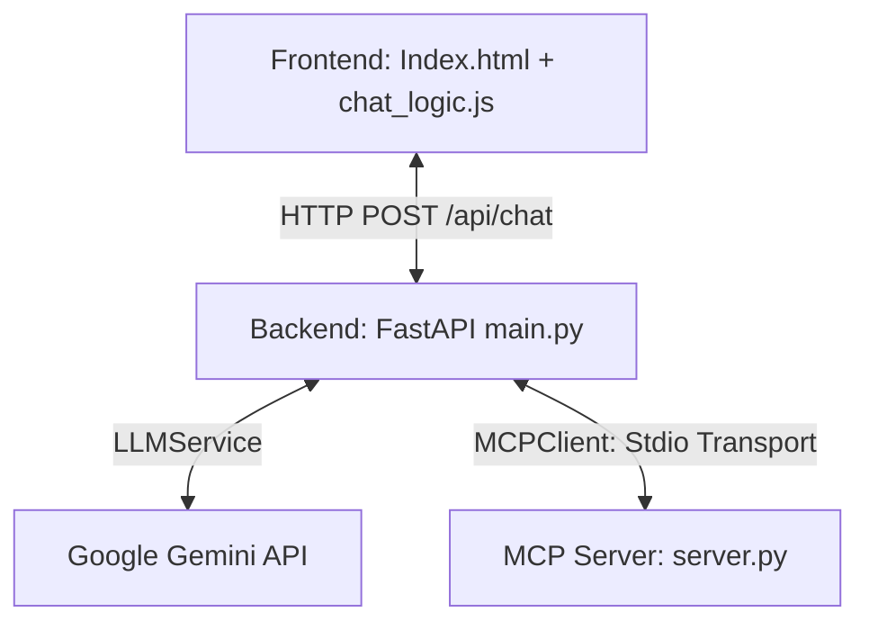

# ContextDesk

## Overview
ContextDesk is a context-aware workspace assistant that integrates Large Language Models (LLMs) with a local Model Context Protocol (MCP) server. Built as an academic pair-programming prototype, it demonstrates how LLMs can dynamically discover and invoke local tools (e.g., retrieving local system time, executing mathematical calculations, or querying project metadata) using standard stdio transport protocols.

---

## Features
* **Dynamic Tool Discovery**: Dynamically maps and registers local MCP tool schemas with the Gemini LLM at runtime.
* **Local MCP Server**: Exposes utility tools (`get_current_time`, `calculate`, and `get_project_info`) via standard input/output (`stdio`).
* **Robust Error Isolation**: Gracefully recovers from subprocess execution timeouts, missing tool definitions, and tool crashes (like division by zero) without crashing the FastAPI application.
* **Responsive Chat UI**: A lightweight, responsive chat interface styled with Tailwind CSS, showing animated loading states and distinct tool execution badges.

---

## Architecture
ContextDesk operates with a decoupled, three-tier architecture:



1. **Frontend**: A static client application served locally. Communicates asynchronously with the backend API via `fetch` requests.
2. **FastAPI Backend**: Manages the HTTP server, handles application lifecycles (startup/shutdown), wraps the Google GenAI SDK client, and manages the MCP client session connection stack.
3. **MCP Server**: A standalone background process spawned by the backend. It receives JSON-RPC frames over standard input (`stdin`) and replies over standard output (`stdout`).

---

## Technology Stack
* **Frontend**: HTML5, Tailwind CSS (CDN), Vanilla JavaScript (ES6)
* **Backend API**: Python, FastAPI, Uvicorn, Pydantic, python-dotenv
* **LLM Engine**: Google GenAI Python SDK (`google-genai`), Gemini 2.0 / 3.5 Models
* **Protocol**: Model Context Protocol (MCP) Python SDK

---

## Project Structure
```text
contextdesk/
├── backend/
│   ├── main.py          # FastAPI application & CORS setup
│   ├── llm_service.py   # Gemini Client & Tool dispatch logic
│   ├── mcp_client.py    # MCP Client Stdio session manager
│   ├── requirements.txt # Minimal pinned Python dependencies
│   └── venv/            # Python virtual environment
├── mcp_server/
│   └── server.py        # Local MCP server exposing tools
├── frontend/
│   ├── index.html       # Chat UI Markup
│   ├── css/
│   │   └── styles.css   # Custom scrollbars and styling
│   └── js/
│       └── chat_logic.js# Event listeners & API interactions
└── README.md            # This documentation
```

---

## Prerequisites
* **Python**: Python 3.10+
* **Node.js** (Optional): For running the visual MCP Inspector.
* **Gemini API Key**: A valid API key from Google AI Studio.

---

## Installation

1. Navigate to the `backend/` directory:
   ```bash
   cd backend
   ```
2. Activate your virtual environment:
   ```bash
   source venv/bin/activate
   ```
3. Install the dependencies:
   ```bash
   pip install -r requirements.txt
   ```

---

## Environment Variables
Create a file named `.env` in the `backend/` directory with the following variables:
```ini
# Your Google Gemini API Key
GEMINI_API_KEY=your_gemini_api_key_here

# The Gemini model to use (default: gemini-2.0-flash)
GEMINI_MODEL=gemini-2.0-flash
```

---

## Running the MCP Server
The MCP server is designed to be spawned automatically as a subprocess by the backend. However, you can run or test it standalone:
```bash
# Standalone run (will wait for stdio input)
python mcp_server/server.py

# Interactive testing with MCP Inspector
npx @modelcontextprotocol/inspector backend/venv/bin/python mcp_server/server.py
```

---

## Running the Backend
Start the FastAPI server from the `backend/` directory:
```bash
cd backend
uvicorn main:app --reload
```
This runs the API server locally at `http://127.0.0.1:8000`.

---

## Running the Frontend
You can serve the `frontend/` directory using any static web server. For example:
```bash
# Using Python's built-in server from the project root
python -m http.server 5500
```
Then open `http://127.0.0.1:5500` in your web browser.

---

## Example MCP Queries
Once both servers are running, type the following queries in the chat UI to test the MCP integration:
* **Time Tool**: *"What is the current local time?"* (invokes `get_current_time`)
* **Calculation Tool**: *"Multiply 45 by 89"* (invokes `calculate`)
* **Project Info**: *"Tell me about this project"* (invokes `get_project_info`)

---

## Error Handling
* **CORS Rejection**: The backend CORS configuration specifically registers port `5500` and standard local ports, preventing cross-origin preflight `OPTIONS` blocks.
* **Server Offline**: If the MCP Server subprocess fails to spawn or crashes, the backend logs the issue and falls back to conversational LLM mode without raising errors or freezing requests.
* **Runtime Calculation Errors**: Division by zero and invalid operations are caught on the MCP Server, returned as JSON-RPC error frames, and synthesized by the LLM as user-friendly explanations.

---

## Security
* **API Key Safety**: The `GEMINI_API_KEY` is loaded strictly from the environment variables into the backend. It is never printed, logged, or sent in JSON response payloads to the frontend.
* **Subprocess Security**: Subprocess arguments are configured explicitly as a list (no shell expansion or string evaluations), avoiding command injection.
* **Input Sanitization**: User messages are escaped in JavaScript before being rendered in the DOM to mitigate Cross-Site Scripting (XSS).

---

## Future Improvements
* **Local Database Tooling**: Add a tool to query local SQLite workspace configurations.
* **Enhanced Chat History**: Retain full multi-turn conversational history inside the LLM payload.
* **Markdown Parser**: Integrate a lightweight frontend Markdown library to render code blocks and text formatting returned by the LLM.
